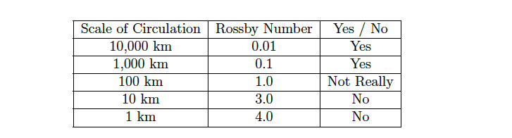

=====================
Mathematics of AMSIMP
=====================

.. _geostrophic_wind:

Geostrophic Wind
================

There are a number of forces that can either change the force or
direction of wind. Two of the biggest forces of wind vectors are the
pressure gradient force and the Coriolis force.

Pressure-Gradient Force
-----------------------

The pressure-gradient force is a force acting on air that is due to
pressure differences.

Horizontal variations in pressure create a tendency for movement from
higher to lower pressure. The atmosphere, like all systems in nature, is
trying to stay at the lowest energy level possible. Therefore, if there
is an area of lower pressure nearby, air will freely move from the high
pressure area to the low pressure area in order to equalise this energy
gradient. To do this, it will attempt to take the shortest distance
possible in order to maximise efficiency, which happens to be
perpendicular to the isobars :cite:`PGF_DEFINITION`. This
phenomenon is described by the following equation, where :math:`P` is the
pressure-gradient force.

.. math::

   \label{pressure_grad}
       P = - \vec{\nabla} p

The negative sign at the beginning of the equation designates that we
move from high to low across the pressure gradient. The greater the
difference in pressure between the two locations, the greater the
pressure gradient. A stronger pressure-gradient force usually correlates
to a stronger wind vector. It must be noted that the pressure-gradient
force is only one component of the forces acting on the actual wind,
though, so, air does not normally flow perpendicular to the
isobars :cite:`PGF`.

Coriolis Force
--------------

The Coriolis force is an inertial force that acts on objects that are in
motion within a frame of reference that rotates with respect to an
inertial frame.

The Coriolis force ultimately results in the diversion of the wind’s
direction within the atmosphere due to the Earth’s rotation. The Earth
is spinning in a prograde direction. The Earth is a elongated spheroid,
however, to a reasonable good approximation, it can be considered to be
a sphere. Due to this fact, all points on the surface of the Earth are
travelling at the same angular velocity. As a consequence, however, a
point near the equator must have a higher linear velocity, as it must
travel a larger distance than a point near the poles. When an object
moves either closer or further from the equator its original momentum is
preserved, giving the path a diversion off its original
course :cite:`corioliseffect_def`. If the wind is travelling
in accordance with the pressure-gradient force, the wind will be
deflected off its original course by the Coriolis force. It must be
noted that there isn’t a Coriolis force at the equator, however, it
increases with intensity as one approaches the poles. The Coriolis force
is described by the following equation:

.. math::

   \label{coriolis_force}
       F = \rho U f

where :math:`f` is the Coriolis parameter, and is given as follows:

.. math::

   \label{f}
       f = 2 \Omega \sin{\phi}

One can therefore deduce that the higher the latitude, the higher the
Coriolis force. Also, The Coriolis force only acts on air that is
already set into motion. The Coriolis force will not set wind into
motion, but will only deflect the direction of wind that is already
moving. Therefore, it follows that the faster that air is moving, the
stronger it is affected by the Coriolis
force :cite:`coriolis_effect`.

.. _balance:

Geostrophic Balance
-------------------

Geostrophic Balance is an exact balance between the Coriolis force and
the pressure-gradient force.

This balance seldom holds true in nature. This concept, however, will
lead to the development of a theoretical wind, known as geostrophic
wind. First and foremost, lets introduce the horizontal momentum
equations.

.. math:: \frac{Du}{Dt} = -\frac{1}{\rho}\frac{\partial p}{\partial x} + f v

.. math:: \frac{Dv}{Dt} = -\frac{1}{\rho}\frac{\partial p}{\partial y} - f  u

Assuming geostrophic balance, the system is stationary and the first two
equations become:

.. math:: u = -\frac{1}{\rho f} \frac{\partial p}{\partial y}

.. math:: v = \frac{1}{\rho f} \frac{\partial p}{\partial x}

This is the geostrophic wind, and as mentioned previously, any spatial
derivatives within this equation are replaced by a central difference
approximation of the derivatives. Therefore, the above equations are
rewritten as follows:

.. math:: u_g = -\frac{1}{\rho f} \frac{\Delta p}{2 \Delta y}

.. math:: v_g = \frac{1}{\rho f} \frac{\Delta p}{2 \Delta x}

Geostrophic Wind is the wind that flows parallel to height contours or
isobars resulting from an exact balance between the Coriolis force and
the pressure-gradient force.

For the geostrophic flow concept to work, the wind must not be changing
speed (is unaccelerated or the acceleration is almost zero). The
question remains whether geostrophic wind is a good approximation for
the actual wind. The tendency for wind to be accelerated can be measured
at various scales of circulation. Meanwhile, the Coriolis acceleration
is only related to the speed of the object and its latitude. Thus, as
the flow approaches geostrophic the smaller the actual acceleration is
relative to the Coriolis acceleration :cite:`geo_wind`.

Rossby Number is the ratio of the total acceleration to the Coriolis
acceleration.

If the Rossby number is small (less than one), the geostrophic wind is a
reasonably good approximation for geostrophic wind, neglecting the force
of friction in this assumption. From table below, generally the
geostrophic wind is a good approximation if it is determined at a
synoptic scale :cite:`geo_wind`.

.. _pressure_thickness:

Pressure Thickness
==================

Pressure Thickness is the measurement of the distance (in metres)
between any two constant pressure surfaces.

.. figure:: https://github.com/amsimp/papers/raw/master/project-book/Images/thickness_def.png
   :alt: Pressure Thickness Definition (provided by the NWS of the USA)
   :width: 90%
   :align: center

One of the most common thickness charts used in meteorology is the
1000-500 hPa thickness, and for the purposes of this project, it will be
the sole interest. This is the distance between the elevation of the
1,000 hPa and 500 hPa levels. Typically, the 1,000 hPa surface is used
to represent sea level but this is just a generalisation. On pressure
charts, the last digit (zero) of a thickness value is typically
truncated. So, a 1000-500 thickness value of 570 means the distance
between the two surfaces is 5,700 metres. The 1000-500 hPa thickness
value of 540 is traditionally used to determine rain versus snow. If
precipitation is predicted poleward of this 540-thickness line (if the
thickness value is less than 540), it is expected that it will be snow.
If precipitation is predicted on the equator side of this line (if the
thickness value is greater than 540), then it is expected that the
precipitation will be in a liquid form. The reason one is able to make
such an expectation is due to the fact that the 540-thickness line
closely follows the surface freezing temperature of 273
K :cite:`thickness`.

.. figure:: https://github.com/amsimp/papers/raw/master/project-book/Images/rainsnow_line.png
   :alt: Rain/Snow Line (provided by the NWS of the USA)
   :width: 50%
   :align: center

Traditionally, one would determine the pressure thickness between two
constant pressure surfaces by utilising the Hypsometric equation, as
shown in the equation below. For the purposes of
this project, and simplicity, the pressure thickness will be determined
by using nonlinear regression.

The hypsometric equation relates an atmospheric pressure ratio to the
equivalent thickness of an atmospheric layer considering the layer mean
of virtual temperature, gravity, and occasionally wind. It is derived
from the hydrostatic equation and the ideal gas law.

.. math::

   \label{hypsometric}
       h = \frac{R \bar{T_v}}{g} \ln{\frac{p_1}{p_2}}

Nonlinear regression is a form of regression analysis in which
observational data are modelled by a function which is a nonlinear
combination of the model parameters and depends on one or more
independent variables.

In general, there is no closed-form expression for the best-fitting
parameters, as there is in linear regression. Usually numerical
optimisation algorithms are applied to determine the best-fitting
parameters :cite:`nonlingress_def`. In the software, the
SciPy method, scipy.optimize.curve_fit, is utilised to perform the
nonlinear regression. This method uses nonlinear least squares to fit a
function to the data. The algorithm used by this particular method of
SciPy is the Levenberg-Marquardt
algorithm :cite:`scipy_nonlingress`. Following which, the
inverse of this modelled function is used to determine the altitude at
which the constant pressure surfaces of 1000 hPa and 500 hPa would be.

Levenberg-Marquardt algorithm is used to solve non-linear least squares
problems. These minimisation problems arise especially in least squares
curve fitting.

Atmospheric pressure decreases exponentially with altitude. Therefore,
the relationship between atmospheric pressure and altitude, with altitude
being the independent variable and atmosphere pressure being the dependent
variable, is modelled on an exponential function. The particular
exponential function of choice is shown in the following equation:

.. math::

   \label{exponential_function}
       a - \frac{b}{c} (1 - \exp(-c x))

While it is not possible to state the values of :math:`a`, :math:`b`,
and :math:`c` due to the fact they are calculated on a case by case
basis, at a given latitude and longitude, the ‘guess’ value of :math:`a`
is 1000, of :math:`b` is 0.12, and of :math:`c` is 0.00010. It is also
important to note that the mean :math:`R^2` is approximately 0.99.

Precipitable Water
==================

Precipitable Water is the total atmospheric water vapour contained in a
vertical column of unit cross-sectional area extending between any two
specified pressure levels.

Based on the definition, precipitable water can be described
mathematically as being:

.. math::

   \label{pwv_1}
       W = \int_{0}^{z} \rho_v dz

where :math:`\rho_v` is the density of water vapour, and where
:math:`\rho_v` is defined as:

.. math:: \rho_v = \frac{\texttt{mass of vapour}}{\texttt{unit volume}}

Following which, the hydrostatic equation can be applied to the orginial
equation in order to replace :math:`dz` with :math:`dp`. The
reason for doing this is that atmospheric pressure is extremely easier
to measure, with devices such as weather balloons being readily
available.

.. math::

   \label{pwv_derive}
       W = -\int_{p_1}^{p_2} \frac{\rho_v}{\rho g} dp

Where :math:`p_1` and :math:`p_2` are constant pressure surfaces, and
where :math:`p_1 > p_2`. Substituting in the definition of density,
:math:`\rho_v = \frac{m_v}{V}; \rho = \frac{m_{air}}{V}`, into the
aforementioned equation results in:

.. math:: W = -\int_{p_1}^{p_2} \frac{1}{g} \frac{m_v V}{m_{air} V} dp

.. math:: \Rightarrow W = - \frac{1}{g} \int_{p_1}^{p_2} \frac{m_v}{m_{air}} dp

The integration term in this particular equation is the definition for
the specific humidity, with the units of measurement being
:math:`\frac{kg}{kg}`. The specific humidity can be approximated by the
mixing ratio, with an error typically around 4% :cite:`pwv_def`.

Mixing Ratio is the ratio of the mass of a variable atmospheric
constituent to the mass of dry air.

.. math::

   \label{pwv_derive_fin}
       \therefore W = -\frac{1}{g} \int_{p_1}^{p_2} m dp

The units as given by the equation are :math:`\frac{kg}{m^2}`
(dimensionless), but, the preferred unit of measurement for rainfall is
:math:`mm`. The conversion between the two units of measurements is one
to one (:math:`1 \frac{kg}{m^2} = 1 mm`) In actual rainstorms,
particularly thunderstorms, amounts of rain very often exceed the total
precipitable water of the overlying atmosphere. This results from the
action of convergence that brings into the rainstorm the water vapour
from a surrounding area that is often quite large. Nevertheless, there
is general correlation between precipitation amounts in given storms and
the precipitable water of the air masses involved in those
storms :cite:`problems_with_pwv`.

For the purposes of numerically calculating the precipitable water for a
given column of air, the aforementioned equation is
commonly rewritten as the following:

.. math::

   \label{pwv}
       W = -\frac{1}{\rho g} \int_{p_1}^{p_2} \frac{0.622 e}{p - e} dp

Vapour Pressure is the pressure exerted by a vapour when the vapour is
in equilibrium with the liquid or solid form, or both, of the same
substance. In meteorology, vapour pressure is used almost exclusively to
denote the partial pressure of water vapour in the atmosphere.

For the purposes of this project, the saturated vapour pressure will be
utilised, in place of the actual vapour pressure. Saturated vapour
pressure is the maximum pressure possible by water vapour at a given
temperature. One can determine the saturated vapour pressure using the
following equation :cite:`balton`:

.. math:: e = 6.112 \exp(\frac{17.67 T}{T + 243.5})

Saturated precipitable water on a synoptic scale is a pretty good
approximation for the actual precipitable water. In wet periods, the
precipitable water is particularly close to the saturated precipitable
water. In situations when the precipitable water is close to the
saturated precipitable water, the precipitable water changes very little
over the day. Saturated precipitable water also makes calculations a
whole lot simpler, as specific humidity data is rather difficult to come
by. In the release candidate version of the software, a move away from
saturated vapour pressure will be made :cite:`pwv_error`.

In regards to the numerical calculation of the saturated precipitable
water, the SciPy method, scipy.integrate.quad, is utilised in order to
determine the definite integral. This
method integrates the function using a technique from the Fortran
library, QUADPACK :cite:`scipy_integrate`.

Primitive Equations
===================

The Primitive Equations, or sometimes known as the Forecast Equations,
are a set of nonlinear partial differential equations which approximate
global atmospheric circulation, and are utilised in most atmospheric
models.

These equation are time dependent, and are used to predict the future
state of the atmosphere. There are a total of five distinct equations:
two of these are for the horizontal wind components, and there is one
each for temperature, pressure thickness and precipitable
water :cite:`nws`. These prediction equations can be written
as follows:

.. math::

   \frac{\partial u}{\partial t} = \eta v - \frac{\partial \Phi}{\partial x} - c_{p} \theta \frac{\partial \Pi}{\partial x} - z \frac{\partial u}{\partial \sigma} - \frac{\partial (\frac{u^2 + v^2}{2})}{\partial x}
       \label{prim_u}

.. math::

   \frac{\partial v}{\partial t} = - \eta \frac{u}{v} - \frac{\partial \Phi}{\partial y} - c_{p} \theta \frac{\partial \Pi}{\partial y} - z \frac{\partial v}{\partial \sigma} - \frac{\partial (\frac{u^2 + v^2}{2})}{\partial y}
       \label{prim_v}

.. math::

   \frac{\partial T}{\partial t} = \vec{v} \cdot \nabla T
       \label{og_primtemp}

.. math::

   \frac{\partial W}{\partial t} = \vec{v} \cdot \nabla W
       \label{og_primw}

.. math::

   \frac{\partial}{\partial t} \frac{\partial p}{\partial \sigma} = u \frac{\partial}{\partial x} \left( x \frac{\partial p}{\partial \sigma} \right) + v \frac{\partial}{\partial y} \left( y \frac{\partial p}{\partial \sigma} \right) + w \frac{\partial}{\partial z} \left( z \frac{\partial p}{\partial \sigma} \right)
       \label{prim_h}

For the purposes of this project, only the
third and fourth equations will be
utilised. The reason for not utilising
equations the first two equations is quite
simple. Due to utilisation of geostrophic wind, there is an exact
balance between the Coriolis force and the pressure gradient force. This
implies that there is no acceleration in the geostrophic wind (it
doesn’t change with time), or described mathematically:

.. math::

   \frac{\partial u}{\partial t}, \frac{\partial v}{\partial t} = 0
       \label{bal_eq}

This, therefore, makes the aforementioned equations redundant. The
reason for not utilising the last equation is not as
simple. Instead of using this particular equation to calculate the
pressure thickness, the mass continuity equation will be utilised in
order to forecast the atmospheric density. After which, the Ideal Gas
Law will be invoked in order to determine
the atmospheric pressure; with the pressure thickness between 1000 hPa
and 500 hPa being determined in a similar manner to that described in
`Pressure Thickness <https://docs.amsimp.com/math.html#Pressure-Thickness>`_.

Temperature and Precipitable Water
----------------------------------

To begin, the temperature equation will be the primary focus and is
written as follows:

.. math:: \frac{\partial T}{\partial t} = \vec{v} \cdot \nabla T

First and foremost, the del operator (:math:`\nabla`) will be expanded
into its components as shown in the equation below. The reason for doing
so is that it makes the equation easier to work with down the line.

.. math::

   \Rightarrow \frac{\partial T}{\partial t} = \begin{bmatrix} \vec{v}_x \\ \vec{v}_y \\ \vec{v}_z \end{bmatrix} \cdot \begin{bmatrix} \frac{\partial}{\partial x} \hat{i} \\ \frac{\partial}{\partial y} \hat{j} \\ \frac{\partial}{\partial z} \hat{k} \end{bmatrix} T
       \label{del_operator}

Taking the dot product results in the following:

.. math:: \frac{\partial T}{\partial t} = (\vec{v_{x}} \frac{\partial}{\partial x} \hat{i} + \vec{v_{y}} \frac{\partial}{\partial y} \hat{j} + \vec{v_{z}} \frac{\partial}{\partial z} \hat{k}) T

Expanding the brackets results in:

.. math:: \frac{\partial T}{\partial t} = \vec{v_{x}} \frac{\partial T_{x}}{\partial x} + \vec{v_{y}} \frac{\partial T_{y}}{\partial y} + \vec{v_{z}} \frac{\partial T_{z}}{\partial z}

.. math::

   \Rightarrow \frac{\partial T}{\partial t} = u \frac{\partial T}{\partial x} + v \frac{\partial T}{\partial y} + w \frac{\partial T}{\partial z}
       \label{analytic_temp_final}

The terms on the RHS are due to advection within the atmosphere.

Advection is the transport of a substance or quantity by bulk motion.

Each :math:`T` is actually different and related to its respective
plane. This is divided by the distance between grid points to get the
change in temperature with the change in distance. When multiplied by
the wind velocity on that plane, the units :math:`K m^{-1}` and
:math:`m s^{-1}` give :math:`K s^{-1}`. The sum of all the changes in
temperature due to motions in the :math:`x`, :math:`y`, and :math:`z`
directions give the total change in temperature with
time :cite:`primitive_equations`.

It is not possible to solve this equation analytically, however, one can
get an approximate numerical solution by using the finite difference
method. To do this, it is necessary to discretize this equation in both
space and time, using the central difference scheme. The primary reason
for choosing the central difference scheme is that its convergence rate
is faster than some other finite difference methods, such as forward and
backward differencing. Therefore, discretizing the aforementioned
equation results in:

.. math:: \frac{T^{n + 1}_{x, y, z} - T^{n - 1}_{x, y, z}}{2 \Delta t} = u \frac{T^{n}_{x+1, y, z} - T^{n}_{x-1, y, z}}{2 \Delta x} + v \frac{T^{n}_{x, y+1, z} - T^{n}_{x, y-1, z}}{2 \Delta y} + w \frac{T^{n}_{x, y, z+1} - T^{n}_{x, y, z-1}}{2 \Delta z}

The vertical advection term is equal to zero, as there isn’t a vertical
geostophic wind (:math:`w = 0`):

.. math:: \frac{T^{n + 1}_{x, y, z} - T^{n - 1}_{x, y, z}}{2 \Delta t} = u \frac{T^{n}_{x+1, y, z} - T^{n}_{x-1, y, z}}{2 \Delta x} + v \frac{T^{n}_{x, y+1, z} - T^{n}_{x, y-1, z}}{2 \Delta y}

Multiplying both the LHS and the RHS by :math:`2 \Delta t` in order to
isolate the change in temperature with respect to time term results in
the following:

.. math:: T^{n + 1}_{x, y, z} - T^{n - 1}_{x, y, z} = u \frac{2 \Delta t}{2 \Delta x} (T^{n}_{x+1, y, z} - T^{n}_{x-1, y, z}) + v \frac{2 \Delta t}{2 \Delta y} (T^{n}_{x, y+1, z} - T^{n}_{x, y-1, z})

Rearranging the equation in order to isolate the
:math:`T^{n + 1}_{x, y, z}` term, and simplifying, results in the
following:

.. math:: T^{n + 1}_{x, y, z} - T^{n - 1}_{x, y, z} = u \frac{2 \Delta t}{2 \Delta x} (T^{n}_{x+1, y, z} - T^{n}_{x-1, y, z}) + v \frac{2 \Delta t}{2 \Delta y} (T^{n}_{x, y+1, z} - T^{n}_{x, y-1, z})

.. math::

   \Rightarrow T^{n + 1}_{x, y, z} - T^{n - 1}_{x, y, z} = u \frac{\Delta t}{\Delta x} (\Delta T_{x})
       + v \frac{\Delta t}{\Delta y} (\Delta T_{y})

.. math::

   \Rightarrow T^{n + 1}_{x, y, z} = T^{n - 1}_{x, y, z} + u \frac{\Delta t}{\Delta x} (\Delta T_{x})
       + v \frac{\Delta t}{\Delta y} (\Delta T_{y})

The same process applies for the precipitable water equation:

.. math:: \frac{\partial W}{\partial t} = \vec{v} \cdot \nabla W

which yields:

.. math::

   W^{n + 1}_{x, y, z} = W^{n - 1}_{x, y, z} + u \frac{\Delta t}{\Delta x} (\Delta W_{x})
       + v \frac{\Delta t}{\Delta y} (\Delta W_{y})

The equation functions in a similar manner to the temperature equation.
The equation describes the movement of water as it travels from one
point to another without taking into account that water changes form.
Inside the atmosphere, the total change in water is zero. However,
concentrations are allowed to move with wind
flow :cite:`primitive_equations`.

Pressure Thickness
------------------

Mass Continuity Equation is a hydro-dynamical equation that expresses
the principle of the conservation of mass in a fluid. It equates the
increase in mass in a hypothetical fluid volume to the net flow of mass
into the volume.

Imagine a cube at a fixed point within the atmosphere. The net change in
mass contained within the cube is found by adding up the mass fluxes
entering and leaving through each face of the cube :cite:`rho_primitive`.
A flux is a quantity per unit area per unit time. Mass flux is therefore
the rate at which mass moves across a unit area, and would have units of
:math:`kg \cdot s^{-1} \cdot m^{-2}`\.

The mass flux, :math:`m_f`, across a face of the cube normal to the
x-axis is given by :math:`\rho u`. These fluxes will lead to a rate of
change in mass within the cube given by:

.. math::
   \frac{\partial m_f}{\partial t} = (\rho u)_x \Delta y \Delta z - (\rho u)_{x + \Delta x} \Delta y \Delta z

The mass in the cube can be written in terms of the density as
:math:`m_f = \rho \Delta x \Delta y \Delta z` so that:

.. math::
       \frac{\partial m_f}{\partial t} = \frac{\partial \rho}{\partial t} \Delta x \Delta y \Delta z

Equating the aforementioned equations gives:

.. math:: \frac{\partial \rho}{\partial t} = \frac{(\rho u)_x - (\rho u)_{x + \Delta x}}{\Delta x}

and in the :math:`\lim_{\Delta z \to 0}`:

.. math:: \frac{\partial \rho}{\partial t} = - \frac{\partial (\rho u)}{\partial x}

Similar analysis can be done for the fluxes across the other four faces
to yield the mass continuity equation:

.. math:: \frac{\partial \rho}{\partial t} = - \frac{\partial (\rho u)}{\partial x} - \frac{\partial (\rho v)}{\partial y} - \frac{\partial (\rho w)}{\partial z}

which can be rewritten in vector form as the
following :cite:`rho_primitive`:

.. math:: \frac{\partial \rho}{\partial t} = -\vec{v} \cdot \nabla \rho

Using the same method that was used to discretize the temperature and
precipitable primitive equations, the mass continuity equation becomes:

.. math::

   \rho^{n + 1}_{x, y, z} = \rho^{n - 1}_{x, y, z} - u \frac{\Delta t}{\Delta x} (\Delta \rho_{x})
       - v \frac{\Delta t}{\Delta y} (\Delta \rho_{y})

This equation, therefore, allows for the prediction of atmospheric
density. Using the Ideal Gas Law, the atmospheric pressure can be determined.
Following which, the pressure thickness between the constant pressure
surfaces of 1000 hPa and 500 hPa can be determined in a similar manner
to that described in the `Pressure Thickness section <https://docs.amsimp.com/math.html#Pressure-Thickness>`_.

References
----------

.. bibliography:: refs.bib
       :style: plain
